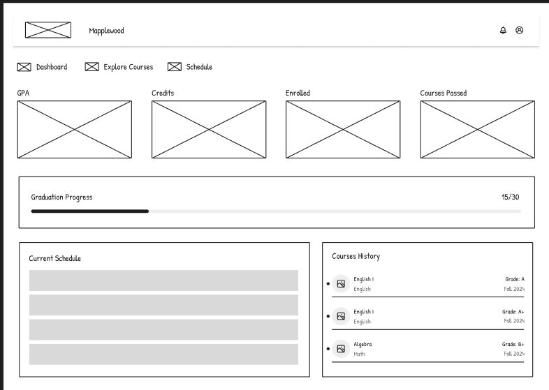
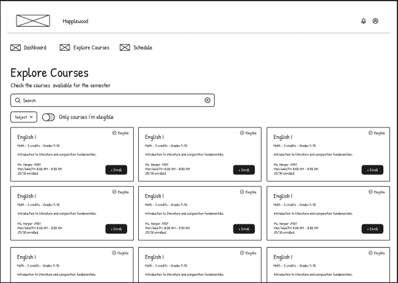
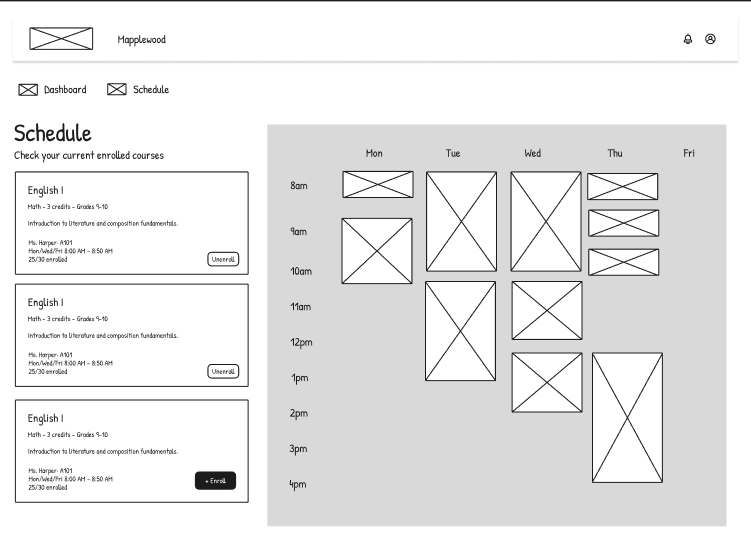
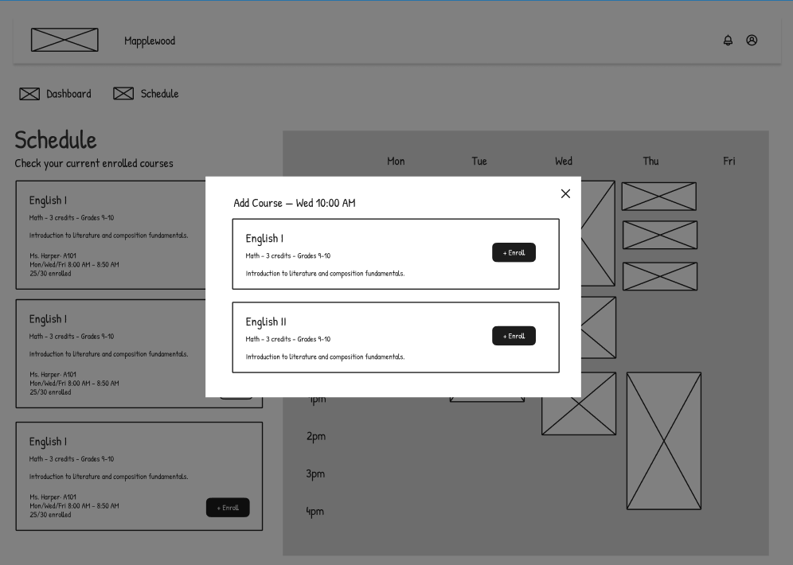
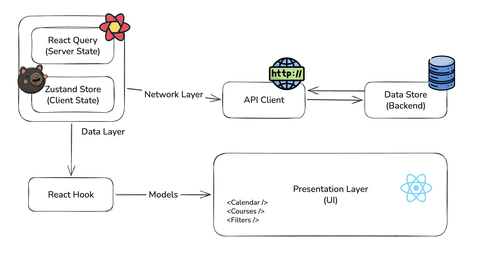
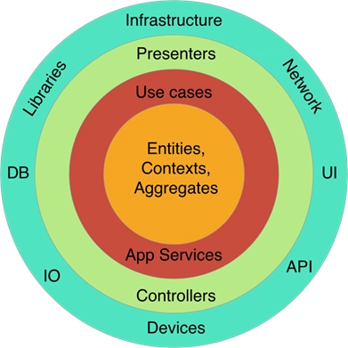

# Context

We are building an application that helps students plan their semester, understand graduation progress, and manage course enrollment with clarity and confidence.

# Screens

The frontend includes three main screens. Across all of them, we should keep:

- Responsive layouts
- Good performance
- Clear feedback
- Intuitive UX
- Explicit UI states (loading, error, success, empty)

## Dashboard

The dashboard provides a quick snapshot of the student's current academic status.

It includes information such as GPA, credits, active enrollments, course history, and graduation progress.



**Capabilities**

- View graduation progress metrics (GPA, credits, completion percentage)
- View course history with final status by semester
- View summary information for the active semester

## Explore Courses

The Explore Courses screen gives students a broad and detailed view of available courses, including credits, sections, eligibility, and schedule times.

It also provides filters to help users quickly find relevant courses.



**Capabilities**

- Search courses
- Filter courses by content and eligibility
- Inspect available sections and meeting times
- Check whether the student is eligible
- Enroll in a selected section

## Schedule

The Schedule screen allows students to manage their current semester plan, including adding and removing enrollments.




**Capabilities**

- Show enrolled courses in calendar format
- Click a time slot to add a course section
- Unenroll from scheduled courses
- Keep schedule conflicts visible and easy to understand

# Business Rules

- A course may require a prerequisite course
- Students can enroll in at most 5 courses per semester
- Students need 30 earned credits to graduate
- Courses cannot overlap in time
- Enrollment must respect the student's grade level

# Project Architecture - Frontend

The frontend stack:

- React for UI
- React Router for routing
- Vite for development/build tooling
- TypeScript for type safety
- Tailwind CSS for styling
- shadcn/ui + Radix primitives for accessible UI components
- TanStack Query for server-state management
- Zustand for client/global state
- Vitest + Testing Library for unit/component tests
- ESLint + Prettier for code quality and formatting

Using a UI component foundation helps us move faster while keeping accessibility and consistency at a good baseline.


## Frontend Architecture

We follow a container-oriented flow where UI components focus on rendering, while hooks and the data layer handle orchestration.



High-level flow:

1. Page/components call feature hooks
2. Hooks consume `queries/*/query.ts` definitions
3. Query functions call `api/*` modules
4. Cache updates and invalidations are centralized in `queries/*/cache.ts`
5. Hooks expose stable data and actions back to UI components


## Project Structure

Current structure in `frontend/src`:

```txt
frontend/src/
  api/                  # HTTP modules grouped by backend resource
  components/           # UI components grouped by feature and base UI
  config/               # API client, env setup, router setup
  helpers/              # Pure helpers and cache-key helpers
  hooks/                # Feature hooks that orchestrate UI behavior
  lib/                  # Shared library setup (React Query client, utils)
  mocks/                # MSW handlers/browser setup
  pages/                # Route-level page components
  queries/              # Data layer for server state (queries + cache mutations)
    auth/
      query.ts
    courses/
      query.ts
      cache.ts
    enrollments/
      query.ts
      cache.ts
    students/
      query.ts
      cache.ts
  stores/               # Zustand stores (client/global state)
  types/                # Domain and view-model types
  App.tsx
  main.tsx
```

### Data Layer Notes

`queries` is part of the data layer and is organized by domain:

- `query.ts`: query/mutation option builders (`queryOptions`, `mutationOptions`)
- `cache.ts`: query key factories and centralized cache mutation logic (`setQueryData`, invalidation)

This keeps cache mutation behavior in one place, avoids scattered invalidation logic inside UI hooks/components, and makes data updates easier to test.

## Frontend Data Layer Flow

We have 2 concepts of state: client-state and server-state

In the frontend, the server data are centralized with React Query (TanStack Query):

- Query keys are centralized by domain (`queries/*/cache.ts`)
- Read/write flows use a shared cache source (`queryClient`)
- After enroll/unenroll, we update cache and invalidate to reconcile backend state

This gives us fast UI updates, less overfetching, and predictable state sharing across screens (courses, schedule, dashboard-related views).

### Why not use Zustand for everything?

Using Zustand for all data flows would work, but it would make server-data orchestration more manual and harder to keep consistent across features.

In our current data layer, we centralize:

- Query/mutation contracts by domain (`queries/*/query.ts`)
- Query keys and cache update rules (`queries/*/cache.ts`)
- Invalidation and synchronization logic close to data access

So the split remains intentional:

- Data layer (`queries` + `api`) for backend-driven data orchestration
- Zustand for client-owned state (session context, local UI flows, filters, drafts)

## Frontend Models (UI/Data Layer)

Frontend models live in `frontend/src/types` and are optimized for UI composition and data-layer consumption.

### Semester

```ts
export interface Semester {
    id: number;
    name: string;
    year: number;
    orderInYear: number;
}
```

### Course

```ts
export interface CoursePrerequisite {
    id: number;
    code: string;
    name: string;
}

export interface CourseGradeLevel {
    min: number;
    max: number;
}

export interface CourseSection {
    id: number;
    teacher: {
        id: number;
        name: string;
    };
    meetingTimes: Array<{
        dayOfWeek: string;
        startTime: string;
        endTime: string;
    }>;
    capacity: number;
    enrolledCount: number;
}

export interface Course {
    id: number;
    code: string;
    name: string;
    credits: number;
    hoursPerWeek: number;
    prerequisite?: CoursePrerequisite;
    gradeLevel: CourseGradeLevel;
    availableSections: CourseSection[];
    semester?: Semester;
}
```

### Student

```ts
export interface Student {
    id: number;
    firstName: string;
    lastName: string;
    gradeLevel: number;
    email: string;
    gpa: number;
    credits: {
        earned: number;
        max: number;
    };
    options: {
        maxCoursesPerSemester: number;
    };
    activeSemester?: {
        id: number;
        name: string;
        year: number;
        orderInYear: number;
    } | null;
}
```

### Course History

```ts
export interface CourseHistory {
    id: number;
    courseId: number;
    courseName: string;
    semester: Semester;
    status: "passed" | "failed";
    enrollment?: {
        sectionId: number;
    } | null;
}
```

### Enrollment

```ts
export interface Enrollment {
    id: string;
    course: Course;
    courseSection: CourseSection;
    semester: Semester;
}
```

### Enrollment Availability Error

```ts
export interface EnrollmentAvailabilityError {
    type: "prerequisite" | "conflict" | "max_courses" | "grade_level" | "other";
    message: string;
    prerequisite?: CoursePrerequisite;
}
```

### Dashboard Metrics

```ts
export interface DashboardMetrics {
    gpa: number;
    earnedCredits: number;
    requiredCredits: number;
    remainingCredits: number;
    graduationPercent: number;
    passedCount: number;
    failedCount: number;
}
```

### Scheduler Models

```ts
export type SchedulerEvent = {
    id: string;
    courseId?: number;
    title: string;
    daysOfWeek: number[];
    startTime: string;
    endTime: string;
    isSlotHint?: boolean;
};

export type SchedulerSlotSelection = {
    weekDay: string;
    startTime: string;
    dateLabel: string;
};
```

# Project Architecture - Backend

The backend follows a DDD-oriented layered architecture with clear boundaries between business rules and infrastructure concerns.

## Backend Structure (DDD)

```txt
backend/src/main/java/com/maplewood/
  application/      # Use cases, controllers, DTOs, mappers, application ports
  domain/           # Domain models, domain services, domain exceptions, repository ports
  infrastructure/   # Persistence adapters, JPA entities/repositories, security, config
```



### Layer responsibilities

- `domain`: core business logic and invariants (`Student`, `Course`, `Enrollment`, eligibility rules, domain exceptions). No framework dependency in core rules.
- `application`: orchestrates use cases (for example `CreateEnrollmentUseCase`, `GetMyProfileUseCase`), receives HTTP input through controllers, maps domain to response DTOs.
- `infrastructure`: concrete implementations for ports (repository adapters, JWT/token service, persistence mappings, global exception handler, framework config).

### Request flow

1. Controller receives request (`application/*/controller`)
2. Use case executes orchestration (`application/*/usecase`)
3. Use case calls domain ports and domain services
4. Infrastructure adapters execute persistence/security concerns
5. Application maps result to DTO and returns HTTP response


### Added scheduling tables

To support enrollment by section and time-slot validation, the backend adds three key persistence structures:

- `course_section` (DB: `course_sections`): represents a concrete offering of a course in a semester, including teacher, classroom, capacity, and enrolled count.
- `meeting_times` (DB: `course_section_meeting_times`): stores weekly schedule slots for each section (`day_of_week`, `start_time`, `end_time`). One section can have multiple meeting-time rows.
- `enrollment` (DB: `student_enrollments`): links a student to a selected course section in a specific semester, enforcing uniqueness per student/course/semester.

Relationship summary:

- One `course_sections` row -> many `course_section_meeting_times` rows
- One `student_enrollments` row -> one `course_sections` row (`section_id`)
- `student_enrollments` also references `students`, `courses`, and `semesters`


# Data Contracts and Models

We keep backend model boundaries explicit between domain entities and API contracts.

## Backend Domain Models (DDD)

Domain entities live in `backend/src/main/java/com/maplewood/domain/*/model` and represent business concepts, independent from transport/UI shapes.

Representative examples:

```java
public class Course {
    private Integer id;
    private String code;
    private String name;
    private Double credits;
    private Integer hoursPerWeek;
    private Integer prerequisiteId;
    private Integer gradeLevelMin;
    private Integer gradeLevelMax;
}

public class Student {
    private Integer id;
    private String firstName;
    private String lastName;
    private String email;
    private Integer gradeLevel;
}

public class Enrollment {
    private Integer id;
    private Integer studentId;
    private Integer courseId;
    private Integer sectionId;
    private Integer semesterId;
}
```

## Backend API DTOs

API contracts live in `backend/src/main/java/com/maplewood/application/*/dto` and define what controllers expose/accept.

Examples:

```java
public class CoursesResponseDTO {
    private List<CourseDTO> courses;
}

public class StudentProfileResponseDTO {
    private StudentProfileDTO student;
}

public class EnrollmentsResponseDTO {
    private List<EnrollmentDTO> enrollments;
}

public class EnrollmentResponseDTO {
    private EnrollmentDTO enrollment;
}

public record LoginResponseDTO(
    String token,
    long expiresIn,
    String email,
    Integer userId
) {}
```

### Backend cache strategy

In the backend, we use Caffeine as an in-memory local cache (Spring Cache abstraction).

- It is fast and simple for the current scale
- It avoids extra operational complexity
- It works well for repeated reads such as active semester, teachers, courses, and sections

Why not Redis now:

- Redis is a distributed cache and is usually more valuable in multi-instance/high-scale environments
- We do not currently need distributed cache coordination

Future direction:

- Redis is still a strong option when we need horizontal scaling, shared cache across instances, or stronger cross-node cache consistency.

# API Endpoints

Current endpoints used by the frontend data layer:

## Auth

### `POST /login`

Responsibility: authenticate a user by email and return session/token data.

Response model:

```ts
{
    token: string;
    expiresIn: number;
    email: string;
    userId: number;
}
```

## Courses

### `GET /courses`

Responsibility: return all available courses.

Response model:

```ts
{
  courses: Course[];
}
```

### `GET /courses/:id`

Responsibility: return details for a single course (optionally scoped by semester).

Response model:

```ts
Course;
```

## Student (current user)

### `GET /me/profile`

Responsibility: return the current student's profile and academic summary.

Response model:

```ts
{
    student: Student;
}
```

### `GET /me/courses/history`

Responsibility: return the student's completed/attempted course history.

Response model:

```ts
{
  courseHistory: CourseHistory[];
}
```

### `GET /me/enrollments`

Responsibility: return the student's active enrollments.

Response model:

```ts
{
  enrollments: Enrollment[];
}
```

### `POST /me/enrollments`

Responsibility: enroll the current student in a course section.

Request model:

```ts
{
    courseId: number;
    sectionId: number;
}
```

Response model:

```ts
{
    enrollment: Enrollment;
}
```

### `DELETE /me/enrollments?courseId=:courseId`

Responsibility: remove an enrollment for the provided course.

Response model:

```ts
{
    enrollment: Enrollment;
}
```

# Feature Approaches

## Validating user-eligible courses

When the app loads, we fetch:

- All courses for the active semester
- All current user enrollments
- All courses from the user history

Today, we intentionally load all semester courses because the dataset is still small. We also keep courses user-independent, which gives us a simpler and more effective cache strategy, since the same course list can be reused across all users without session-specific cache fragmentation.

Benefits of loading all courses upfront:

- Real-time eligibility validation in the frontend while users enroll/unenroll
- Fewer backend requests, reducing processing load
- Better overall cache utilization

Current behavior:

- Frontend eligibility checks run through the domain hook `useCheckEnrollmentEligibility`
- Backend eligibility validation is still enforced at enroll time (`POST /me/enrollments`)

### What if we need to scale to many courses?

If course volume grows significantly, loading everything upfront will no longer be viable. In that scenario, we should move to paginated course retrieval and introduce a backend eligibility endpoint that accepts a list of course IDs and returns eligibility results for those courses.

A dedicated eligibility endpoint also helps prevent overfetching, because we no longer need to repeatedly fetch full course payloads just to know eligibility status.

We can then cache eligibility-by-course-id in a client store.

Trade-offs of this scalable approach:

- More backend usage
- Extra round-trips and waiting time
- Eligibility feedback is no longer instantly real-time

So this path should be adopted only when scale requires it.

## Student identity via JWT + `/me` namespace

Current approach:

- On login, the backend issues a JWT that includes the student ID claim
- The token cannot be tampered with unless someone has the signing secret
- Student-specific actions are exposed under `/me/*` endpoints

Examples:

- `/me/profile`
- `/me/courses/history`
- `/me/enrollments`

Why this works well:

- Endpoint intent is explicit: `/me/*` always targets the authenticated user
- We avoid repeatedly passing `studentId` in every request
- We reduce authorization ambiguity for user-scoped operations, since identity comes from a signed token and not from client-provided IDs
- Security is stronger for this use case because the student context is fixed by authentication

Trade-off:

- This model is limited for cross-user operations (for example, admin/teacher querying another student)
- For those scenarios, we need dedicated endpoints with explicit `studentId` and role/permission checks

Scalable target architecture:

- Keep domain services with explicit resources, such as:
    - `/enrollments/{studentId}/enroll`
    - `/courses/{studentId}/history`
- Put a BFF in front to orchestrate calls and expose user-friendly APIs (`/me/*` for students, admin/teacher routes for privileged roles)

This gives us both strong user isolation for student flows and flexibility for administrative workflows.

## Centralized enrollment state for enroll/unenroll

We keep enrollments in a centralized cache entry (`me/enrollments`) managed by the data layer.

When a user enrolls or unenrolls:

- `POST /me/enrollments` and `DELETE /me/enrollments` run through centralized mutation options
- Cache updates are applied in one place (`queries/enrollments/cache.ts`) with add/remove operations
- Query invalidation runs after mutation to reconcile final backend state

Why this approach is useful:

- A single enrollment change is reflected across multiple UI contexts
- Course cards can immediately update enrollment status
- Schedule/calendar views can reflect the new section allocation without independent local sync logic
- Other derived states that depend on enrollments stay consistent because all features read from the same source of truth

This centralized model reduces duplicated state transitions in components and keeps enroll/unenroll behavior predictable across the application.

## Semester-aware course resolution

By default, course endpoints use the active semester context:

- `GET /courses` resolves the active semester course list
- `GET /courses/:id` resolves course details in the active semester when `semesterId` is not provided

This default works well for current flows (explore, schedule, and current enrollment operations).  
However, some features need strict semester-specific resolution because sections and course metadata may differ by semester.

Cases that require explicit semester targeting:

- Course history: each record must resolve the course using that record's semester
- Prerequisite/history checks: validation should use the exact semester of the historical enrollment context

Why this matters:

- Section details are semester-dependent (teacher, meeting times, capacity, room)
- Using only active-semester defaults in historical contexts can return mismatched section data and lead to incorrect conclusions

Guideline:

- Keep active-semester defaults for real-time/current screens
- Use explicit `semesterId` for historical and record-bound queries
